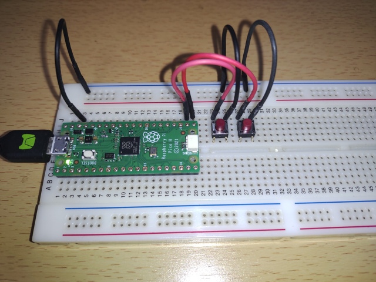
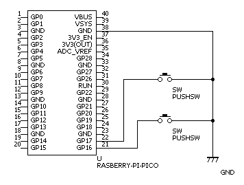

# 概要

本リポジトリは、Raspberry Pi Picoを使用した仮想キーボードのサンプルコードです。USBでPCと接続したときキーボードとして認識され、ボタン入力によって任意のキー入力を行う雛形的プログラムとなっています。また、プログラムはC++を使用して記載しています。

# 開発環境

| 項目 | 説明 |
| ---- | ---- |
| OS | Ubuntu 20.04 |

# セットアップ方法

## Raspberry Pi Picoの開発環境構築

Ubuntuでの環境構築コマンドを以下に記載しておきます。

```
$ cd ‾/
$ mkdir pico
$ cd pico
$ git clone https://github.com/raspberrypi/pico-sdk.git --branch master
$ cd pico-sdk
$ git submodule update --init
$ cd ..
$ git clone https://github.com/raspberrypi/pico-examples.git --branch master
$ sudo apt update
$ sudo apt install cmake gcc-arm-none-eabi libnewlib-arm-none-eabi build-essential
$ echo export PICO_SDK_PATH=/home/user/pico/pico-sdk >> ‾/.bashrc              ***** 適宜変更 *****
$ echo export PICO_EXAMPLES_PATH=/home/user/pico/pico-examples >> ‾/.bashrc    ***** 適宜変更 *****
$ source ‾/.bashrc
```
環境変数は絶対パスで設定しているので、各環境に合わせて変更してください。

## ビルドテスト

以下、サンプル（LED点滅）コードのビルドコマンドです。実行してエラーが出なければ環境構築は成功です。

```
$ cd ‾/pico/pico-examples/
$ mkdir build
$ cd build
$ cmake ..
$ cd blink
$ make
```

その他、詳しくは[公式環境セットアップ資料](https://datasheets.raspberrypi.com/pico/getting-started-with-pico-JP.pdf)を参照してください。

# ビルド方法

以下、本リポジトリのビルドコマンドです。

```
$ cd ‾/pico
$ git clone https://github.com/HASOLabo/Pico_USB_Keyboard_Sample.git
$ cd Pico_USB_Keyboard_Sample
$ mkdir build
$ cd build
$ cmake ..
$ make
```

ビルドしたバイナリは`Pico_USB_Keyboard_Sample.uf2`となります。Picoへのロードは、Pico上のボタンを押したままPCにUSBで接続するとPicoがドライブとして認識されるので、そこに`*.uf2`をコピーすると勝手に再起動してロードしたバイナリが実行されます。  
このあたりも詳しくは[公式環境セットアップ資料](https://datasheets.raspberrypi.com/pico/getting-started-with-pico-JP.pdf)を参照してください。

# 動作確認

以下の構成で動作確認ができます。





# その他

本サンプルを元に開発する場合は[こちら](https://hardwareandsoonlab.blogspot.com/2024/03/pcraspberry-pi-pico.html)に解説記事がありますのでそちらも参考になるかと思います。

